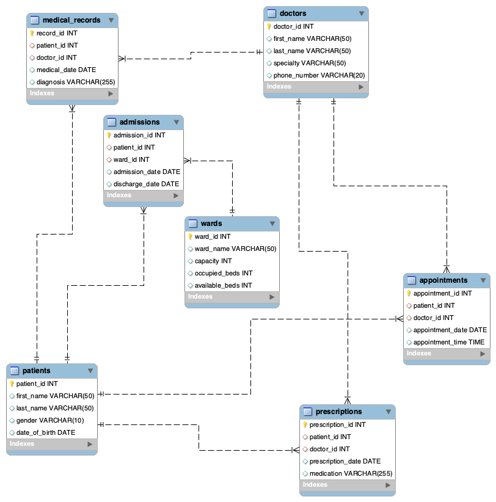

# Mysql 報告

這個資料庫包含七個主要實體，用於管理醫院信息，包括患者、醫生、預約、病歷、處方、住院和病房。每個實體都有特定的功能，對醫院信息的高效管理至關重要。

患者實體包含患者的個人信息，使用患者ID作為主鍵來識別每個患者。
`
patients (patient_id, first_name, last_name, gender, date_of_birth)
`

醫生實體儲存關於醫生的信息，使用醫生ID作為主鍵來識別每位醫生。
`
doctors (doctor_id, first_name, last_name, specialty, phone_number)
`

預約實體管理患者和醫生之間的預約安排，涉及患者和醫生的ID以及預約日期, 使用 appointment_id 作為主鍵
`
appointments (appointment_id,patient_id, doctor_id, appointment_date, appointment_time)
`

病歷實體儲存有關患者症狀和治療日期的信息，使用病歷ID作為主鍵。
`
medical_records (record_id, patient_id, doctor_id, medical_date, diagnosis)
`

處方實體儲存開給患者的藥物信息及開藥日期, prescription 作為主鍵.
`
prescriptions (prescription_id, patient_id, doctor_id, prescription_date, medication)
`

病房實體管理分配給患者的床位，包含病房ID作為主鍵、容量以及已佔用和可用床位數。
`
wards (ward_id, ward_name, capacity, occupied_beds, available_beds)
`

最後，住院實體記錄患者的入院和出院日期, admission_id 作為主鍵.
`
admissions (admission_id, patient_id, ward_id, admission_date, discharge_date)
`

er diagram：




然後錄入相應的數據.


並且做了一些 MySQL 練習題.

show the number of doctors in hospital.
``` sql
select count(doctor_id)
from doctors;
```


show the number of patients corresponding to each doctor.

``` sql
SELECT doctors.doctor_id, doctors.first_name, doctors.last_name, COUNT(patient_id)
FROM doctors
LEFT JOIN appointments ON doctors.doctor_id = appointments.doctor_id
GROUP BY doctors.doctor_id;
```

heck the percentage rate of ward occupation of corresponding department, occupancy rate round off to 3 decimal places.
``` sql
SELECT wards.ward_id, wards.ward_name, ROUND((occupied_beds / capacity) * 100, 3) AS occupancy_rate
FROM wards;
```

show the number of patients whose date of birth is before 1990.
``` sql
select count(*)
from patients
where date_of_birth < '1990-01-01';
```

show the number of patients whose medication are recorded.
``` sql
-- 一個病人，也許有多個 record， 因此用distinct。
select distinct count(patient_id) 
from medical_records;
```

Find the patients who enter hospital before 4th May 2023 and leave after 7th May 2023
``` sql
-- 一個病人，可能再這期間，多次住院。

SELECT DISTINCT patient_id, first_name, last_name
FROM admissions natural join patients
WHERE admission_date <= '2023-05-06' and discharge_date >= '2023-05-07';
```

Find the most common diagnosis in hospital and number of occurrence. 
``` sql
select count(patient_id), diagnosis
from medical_records
group by diagnosis
order by count(patient_id) desc
limit 3;
```

方法二, 先獲得每個病對應的病人數量。
``` sql
with diagnose_num_patients as (
    select count(patient_id) as num_patient, diagnosis
    from medical_records
    group by diagnosis
)

select num_patient, diagnosis
from diagnose_num_patients
where num_patient = (
    -- 獲得患某病的最多數量
    select max(num_patient)
    from diagnose_num_patients
);
```

show the information of patients who do not have appointmens hospital after March 2023.
``` sql
SELECT *
FROM patients
WHERE patients.patient_id NOT IN(
SELECT patient_id
FROM appointments
WHERE appointments.appointment_date > '2023-05-05'
);
```

Show the number of prescriptions written after February 1, 2023 from the patient and prescription table, grouped by patient first and last name.
``` sql
SELECT  patients.first_name, patients.last_name, COUNT(*) AS prescription_count
FROM patients
JOIN prescriptions ON patients.patient_id = prescriptions.patient_id
WHERE prescriptions.prescription_date > '2023-02-01'
GROUP BY patients.first_name, patients.last_name;
```

Show patients from the patients table who do not have any appointments after May 5th, 2023.
``` sql
SELECT *
FROM patients
WHERE patients.patient_id NOT IN(
    SELECT patient_id
    FROM appointments
    WHERE appointments.appointment_date > '2023-05-05'
    );
```


